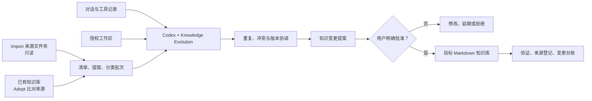

# Knowledge Evolution

把对话、Agent 实际工作和历史资料，转化为**可审核、可追溯、可恢复**的个人知识库变更。

[](LICENSE)


> Proposal-first personal knowledge governance for Codex.

Knowledge Evolution 不是一个“自动把聊天保存成笔记”的工具。它让 Codex 先检查对话、工具行为、工作区变化、已有知识库和用户授权的历史资料，再提出类似 Git Diff 的知识变更；只有用户明确批准后，目标知识库才会被创建或更新。


## 目录

- [为什么需要它](#为什么需要它)
- [核心能力](#核心能力)
- [工作原理](#工作原理)
- [安装](#安装)
- [快速开始](#快速开始)
- [Bootstrap：第一次使用](#bootstrap第一次使用)
- [Import / Adopt：接管已有资料](#import--adopt接管已有资料)
- [日常使用](#日常使用)
- [截图演示](#截图演示)
- [目录结构](#目录结构)
- [脚本与支持格式](#脚本与支持格式)
- [隐私与安全边界](#隐私与安全边界)
- [配置](#配置)
- [验证与测试](#验证与测试)
- [已知限制](#已知限制)
- [常见问题](#常见问题)
- [许可证](#许可证)

## 为什么需要它

普通 AI 笔记流程通常是：

```text
一次对话 → 一篇总结 → 更多孤立笔记
```

Knowledge Evolution 关注的是“这次工作让知识体系发生了什么变化”：

```text
对话 + Agent 工具记录 + 工作区事实 + 已有知识 + 历史资料
                           ↓
                    知识候选与证据
                           ↓
                  重复 / 冲突 / 版本协调
                           ↓
                    可审核的变更提案
                           ↓
                       用户批准
                           ↓
               知识库更新 + 来源登记 + 变更台账
```

它解决的不是单纯的“生成”，而是知识变化的治理：知道内容来自哪里、为什么要改、改了什么，以及如何回滚。

## 核心能力

- **Proposal-first**：任何知识库写入之前，先生成带编号的变更提案。
- **对话与工作区联合观察**：不仅看聊天，还核对 Agent 实际修改的文件、测试和产物。
- **三种 Bootstrap 路线**：新建 Create、原地接管 Adopt、多来源迁移 Import。
- **Obsidian 可选**：普通 Markdown 文件夹即可完整使用，之后可直接作为 Vault 打开。
- **多来源只读导入**：对多个授权文件夹建立清单、哈希、来源定位和迁移提案。
- **可暂停、可恢复**：大量资料按确定性分类批次处理，任务状态独立保存。
- **证据链**：候选知识保留 `source_id`、`file_id`、`chunk_id`、相对路径和定位信息。
- **重复与冲突协调**：区分完全重复、近似重复、历史版本和未解决冲突。
- **持久化初始化状态**：Bootstrap 完成后不会因为下一次调用而丢失或重置。
- **安全默认值**：来源只读、敏感文件排除、内容凭据遮盖、严格路径边界和应用前哈希检查。

## 工作原理



Skill、工作区和知识库始终是三个不同对象：

- **Skill 本体**保存规则、模板和辅助脚本。
- **工作区与来源文件夹**提供事实和历史资料，默认只读观察。
- **目标知识库**只接收用户批准的变更。

升级 Skill 不等于重新初始化用户知识库，也不会用新版空白模板覆盖用户内容。

## 安装

### 方法一：让 Codex 使用内置 Skill Installer

在 Codex 中输入：

```text
用 $skill-installer 从 https://github.com/ChanghaoLiao/knowledge-evolution 安装仓库根目录的 knowledge-evolution Skill。
```

安装完成后新开一个 Codex 任务；如果 Skill 没有立即出现在列表中，再重启 Codex。

### 方法二：运行 Skill Installer 脚本

```bash
python3 "${CODEX_HOME:-$HOME/.codex}/skills/.system/skill-installer/scripts/install-skill-from-github.py" \
  --repo ChanghaoLiao/knowledge-evolution \
  --path . \
  --name knowledge-evolution
```

安装器会把仓库根目录复制到：

```text
${CODEX_HOME:-~/.codex}/skills/knowledge-evolution/
```

如果目标目录已经存在，安装器会停止而不是覆盖。升级前请先检查并保留自己的本地修改。

### 方法三：手动安装

```bash
git clone https://github.com/ChanghaoLiao/knowledge-evolution.git
mkdir -p "${CODEX_HOME:-$HOME/.codex}/skills/knowledge-evolution"
rsync -a --exclude '.git' knowledge-evolution/ \
  "${CODEX_HOME:-$HOME/.codex}/skills/knowledge-evolution/"
```

运行要求：

- Codex，负责发现并调用 Skill；
- Python 3.10 或更高版本，负责可选的审计、快照和 Import / Adopt 流水线；
- Git，可选，用于更准确地观察工作区变化；
- Obsidian，可选，普通 Markdown 目录同样受支持。

## 快速开始

### 1. 先做只读检查

```text
用 $knowledge-evolution 检查我是否需要初始化知识库。
先只读分析并生成提案，不要修改任何文件。
```

### 2. 新建一个不依赖 Obsidian 的知识库

```text
用 $knowledge-evolution 初始化我的个人知识库。
目标目录是 `/你的/知识库路径`。先给我 Bootstrap 提案，不要直接创建文件。
```

### 3. 接管已有 Obsidian Vault

```text
用 $knowledge-evolution 接管这个现有 Vault：`/你的/Vault`。
保留现有目录、标签、frontmatter 和链接规则；先建立索引与提案，不要移动笔记。
```

### 4. 导入多个资料文件夹

```text
用 $knowledge-evolution 把 `/资料/旧笔记` 和 `/资料/项目文档`
纳入目标知识库 `/资料/我的知识库`。
来源保持只读，分批处理，先给我第一轮迁移提案。
```

## Bootstrap：第一次使用

第一次使用时，Skill 不假设用户已经有 Obsidian，也不假设当前工作区就是知识库。它会先判断环境，再选择路线。

| 路线 | 适用情况 | 默认行为 |
| --- | --- | --- |
| Create | 没有知识库或只有空目录 | 提议创建便携 Markdown 结构 |
| Adopt | 已有 Markdown / Obsidian 知识库 | 原地映射，采用已有结构 |
| Import | 资料分散在多个外部文件夹或导出包 | 来源只读，向单独目标库提出迁移 |

### Bootstrap 第一阶段：发现与提案

Agent 会确认：

- 知识库根目录；
- 是否已有 Vault 或 Markdown 目录；
- 哪些旧资料、导出包或项目文件夹允许读取；
- 哪些路径和内容必须排除；
- 用户偏好的语言、链接、命名和目录规则；
- 后续审核策略。

此阶段不会创建目录、移动笔记或修改 `.obsidian/`。

### Bootstrap 第二阶段：用户批准后应用

用户可以批准全部变更、只批准部分编号、要求修改或完全拒绝，例如：

```text
批准 K-01、K-03 和 K-04，其余先延期。
```

只有获批变更会被应用。一个新的知识库可能采用以下起始结构：

```text
00 Inbox/
10 Concepts/
20 Projects/
30 Decisions/
40 Experiences/
50 Resources/
System/
```

这只是新知识库的默认起点，不会强加给已有成熟 Vault。

### 初始化完成后会保留什么

默认系统记录包括：

```text
System/
├── knowledge-evolution.yaml
├── Knowledge Map.md
├── Source Registry.md
├── Change Ledger.md
└── Proposals/
    └── 已批准的 Bootstrap 提案.md
```

- `knowledge-evolution.yaml`：初始化状态、目录映射、授权范围和审核策略；
- `Knowledge Map.md`：当前知识结构和导航入口；
- `Source Registry.md`：来源、边界和最后观察状态；
- `Change Ledger.md`：获批变更、证据和回滚位置；
- `Proposals/`：已经批准并应用的提案版本。

初始化状态是持久的。之后会进入 Evolve 或 Audit，不会重复复制模板或删除初始化信息。

## Import / Adopt：接管已有资料

Import / Adopt 不是一次性“批量总结”。它是一条可恢复、带证据链的治理流水线：

```text
登记授权来源与排除范围
          ↓
只读文件清单与内容哈希
          ↓
跨格式文字提取与敏感值遮盖
          ↓
确定性分类批次与 checkpoint
          ↓
概念 / 项目 / 决策 / 经历 / 资源候选
          ↓
重复 / 冲突 / 版本候选
          ↓
完整协调决定
          ↓
有界 Proposal Wave
          ↓
用户逐项批准
          ↓
目标写入、应用记录与验证
```

### Import

- 外部资料文件夹与目标知识库不能重叠；
- 来源文件始终登记为 `writable: false`；
- 原文件不会被移动、改名、覆盖或删除；
- 整理结果只写入单独目标库中的获批路径。

### Adopt

- 已有知识库同时是比对来源和最终目标；
- 发现、分类和提案阶段仍然只读；
- 只有与获批 Change ID 对应的目标修改才允许记录；
- 验证会把已记录的 Adopt 目标变更和不明外部变化分开。

### 已有目标库再导入外部资料

如果目标库本身已经有内容，目标会登记一次 `adopt` 来源；外部文件夹分别登记为 `import` 来源。这样 incoming knowledge 会和目标里的现有概念、项目和决定一起去重、比较版本和检查冲突。

每个任务使用独立 job 目录，保存 Manifest、批次、候选、协调决定、提案、应用记录和验证报告。job 目录必须位于来源和目标之外。

完整操作协议见 [`references/import-adopt.md`](references/import-adopt.md)。

## 日常使用

Bootstrap 完成后，通常使用 Evolve、Audit 和 Apply。

### 从对话和工作区生成提案

```text
用 $knowledge-evolution 整理这次讨论，同时核对当前项目真实修改了什么。
只生成知识更新提案。
```

### 只做知识体检

```text
用 $knowledge-evolution 审计我的知识库。
只报告重复、冲突、孤立笔记和可能过期的内容，不要修改文件。
```

### 应用部分变更

```text
用 $knowledge-evolution 应用当前提案中的 K-01 和 K-03，其余保持不变。
```

### 重新检查 Agent 的实际工作成果

```text
用 $knowledge-evolution 对照这次对话、工具记录和工作区 diff，
找出值得沉淀的项目决定和状态变化，先给我提案。
```

## 截图演示

以下截图来自一次本地测试流程。图中的用户名、绝对路径、知识主题和 Change ID 都只是演示数据，不是 Skill 的固定配置。

### 从空 Vault 开始


### 用户批准 Bootstrap 变更


### 初始化后的第一版知识图谱


### 知识库持续演化后的图谱


## 目录结构

```text
knowledge-evolution/
├── SKILL.md
├── README.md
├── LICENSE
├── AGENTS.md
├── agents/
│   └── openai.yaml
├── assets/
│   └── templates/
│       ├── knowledge-evolution.yaml
│       ├── adopt-job.json
│       ├── import-job.json
│       ├── import-proposal.md
│       ├── import-report.md
│       └── ...
├── references/
│   ├── onboarding.md
│   ├── import-adopt.md
│   ├── knowledge-schema.md
│   ├── observation.md
│   └── governance.md
├── scripts/
│   ├── audit_knowledge_base.py
│   ├── workspace_changes.py
│   ├── register_sources.py
│   ├── build_source_manifest.py
│   ├── extract_documents.py
│   ├── prepare_import_batches.py
│   ├── manage_import_state.py
│   ├── find_duplicate_candidates.py
│   └── verify_import.py
├── tests/
│   └── test_import_pipeline.py
└── docs/images/
```

## 脚本与支持格式

脚本只负责确定性工作；语义分类和冲突判断由 Agent 完成，知识库写入由用户批准。

| 脚本 | 作用 | 是否修改来源 |
| --- | --- | --- |
| `audit_knowledge_base.py` | 有界知识库体检 | 否 |
| `workspace_changes.py` | Git 状态或前后快照 | 否；只有显式输出快照时写状态文件 |
| `register_sources.py` | 校验来源、目标和 job 边界 | 否 |
| `build_source_manifest.py` | 路径、格式、大小和哈希清单 | 否 |
| `extract_documents.py` | 提取带来源定位的内容片段 | 否 |
| `prepare_import_batches.py` | 建立确定性分类批次 | 否 |
| `manage_import_state.py` | checkpoint、批次状态、候选和应用记录 | 不编辑知识内容 |
| `find_duplicate_candidates.py` | 重复、冲突和版本短名单 | 否 |
| `verify_import.py` | 来源稳定性、证据链和目标哈希验证 | 否；可显式写验证报告 |

直接支持的内容包括：

- Markdown、纯文本和常见代码文件；
- JSON、JSONL、CSV、TSV、YAML、TOML；
- HTML；
- DOCX；
- Jupyter Notebook；
- PDF 文本层（需要 `pypdf`、`PyPDF2` 或系统中的 `pdftotext`）。

无法提取的格式会出现在报告中，不会被假装已经导入。

## 隐私与安全边界

- 只检查用户明确提供或批准的目录。
- 不用主目录、整个桌面、云盘或无关仓库代替缺失的范围。
- `.env`、私钥、凭据文件和常见 token 文件在哈希与提取前排除。
- 普通文档中常见的 API Key、Bearer Token、授权值、带密码 URL 和私钥块会在写入临时提取内容前遮盖。
- 内容遮盖是 defense in depth，不应把已知含敏感信息的目录纳入来源。
- 默认忽略 symlink、`.git`、`node_modules`、构建目录、虚拟环境和缓存。
- Import 来源与目标不得重叠；job 目录必须位于来源和目标之外。
- 应用前重新校验来源哈希；来源变化会让旧提案失效。
- 没有会话前 baseline 或工具记录时，不把 dirty tree 变化归因于当前 Agent。
- 覆盖、删除、批量移动、合并和知识体系重构始终需要单独审核。
- 原始提取片段属于临时证据，不应提交到 Git 或长期同步目录。

## 配置

新知识库可以从 [`assets/templates/knowledge-evolution.yaml`](assets/templates/knowledge-evolution.yaml) 适配，而不是强制复制：

```yaml
version: 1
format: "markdown"
link_style: "markdown"

bootstrap:
  status: "uninitialized"
  initialized_at: null
  route: null
  proposal_id: null
  schema_version: 1

approval:
  mode: "proposal-first"
  auto_apply_low_risk: false
  require_separate_high_risk_approval: true

imports:
  state_root: null
  preserve_sources: true
  batch_max_files: 25
  batch_max_characters: 120000
  keep_extracted_text_after_completion: false
  require_source_hash_check_before_apply: true
```

如果已有知识库拥有自己的目录、frontmatter、wikilink、标签和归档规则，优先采用用户的现有配置。

## 验证与测试

运行结构校验：

```bash
python3 "${CODEX_HOME:-$HOME/.codex}/skills/.system/skill-creator/scripts/quick_validate.py" .
```

运行端到端测试：

```bash
python3 -m unittest discover -s tests -v
```

当前测试覆盖：

- 多来源 Import 和 Adopt 路径边界；
- 敏感文件排除和嵌入凭据遮盖；
- 确定性批次、暂停和恢复；
- 错误 provenance 拒绝；
- 未完成批次阻断；
- 重复与冲突协调完整性；
- Application Change ID 幂等；
- 来源在清单后变化时阻断；
- Adopt 获批目标更新与外部漂移的区分。

该版本通过了 4 个自动化临时夹具集成测试，并完成过一次独立前向测试：两个外部来源加一个已有目标库、9 个清单文件、5 个分类批次，成功推进到 `proposed`，来源和目标文件零写入。

## 已知限制

- 这是 Codex Skill，不是 Obsidian 插件，也不提供独立 GUI。
- 语义分类、去重确认和冲突判断由 Agent 完成；脚本只提供确定性短名单和校验。
- 扫描版 PDF、图片和手写内容没有内置 OCR。
- Notion、OneNote 等系统应先导出为用户可检查的本地文件；当前没有直接 API 连接器。
- 内容敏感值遮盖使用启发式规则，不等于完整 DLP 系统。
- 大规模资料需要时间和上下文预算，设计目标是可暂停、可恢复，而不是未经审核的一键导入。
- Skill 不会自动安装、配置或修改 Obsidian，也不会修改 `.obsidian/`。
- 当前没有自动同步或后台守护进程；每次演化由用户或 Agent 任务触发。

## 常见问题

### 必须安装 Obsidian 吗？

不需要。Knowledge Evolution 的存储契约是普通 Markdown。Obsidian 是一个可选客户端。

### Bootstrap 会修改哪些内容？

发现阶段不修改。用户批准后，只能修改提案中列出的目标知识库路径；不会修改 Skill、本地项目源码或 `.obsidian/` 设置。

### 初始化完成后，初始化信息会消失吗？

不会。初始化状态、路线、授权范围、目录映射、提案和变更历史会持久保存。临时扫描结果和被拒绝的草稿可以清理。

### Import 会改动原始资料吗？

不会。Import 来源永久按只读处理。Adopt 的目标库也只会在用户批准具体 Change ID 后被修改。

### 升级 Skill 会覆盖我的知识库吗？

不会。Skill 目录和知识库目录相互独立。未来配置迁移也应先生成迁移提案。

### 为什么不允许直接自动整理全部内容？

因为重复、冲突、版本和知识结构都包含人的判断。自动化负责降低整理成本，但不应该替用户决定什么是真的、什么应该被删除。

### 如何反馈问题？

请在 [GitHub Issues](https://github.com/ChanghaoLiao/knowledge-evolution/issues) 提供：使用模式、脱敏后的目录结构、命令输出、当前 stage，以及预期行为。不要上传真实知识库、提取片段、token 或凭据。

## 许可证

本项目使用 [MIT License](LICENSE)。

欢迎提交 Issue 或 Pull Request。参与贡献时，请保持来源只读、proposal-first 和显式审批这三条核心边界，并为脚本变化补充临时夹具测试。
